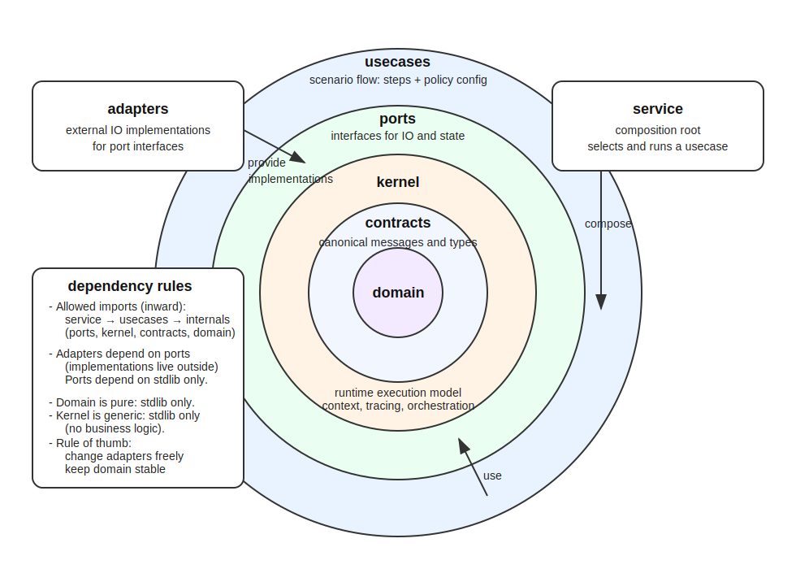
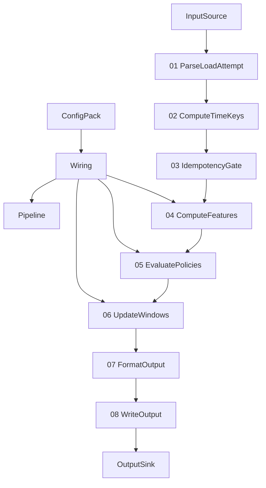
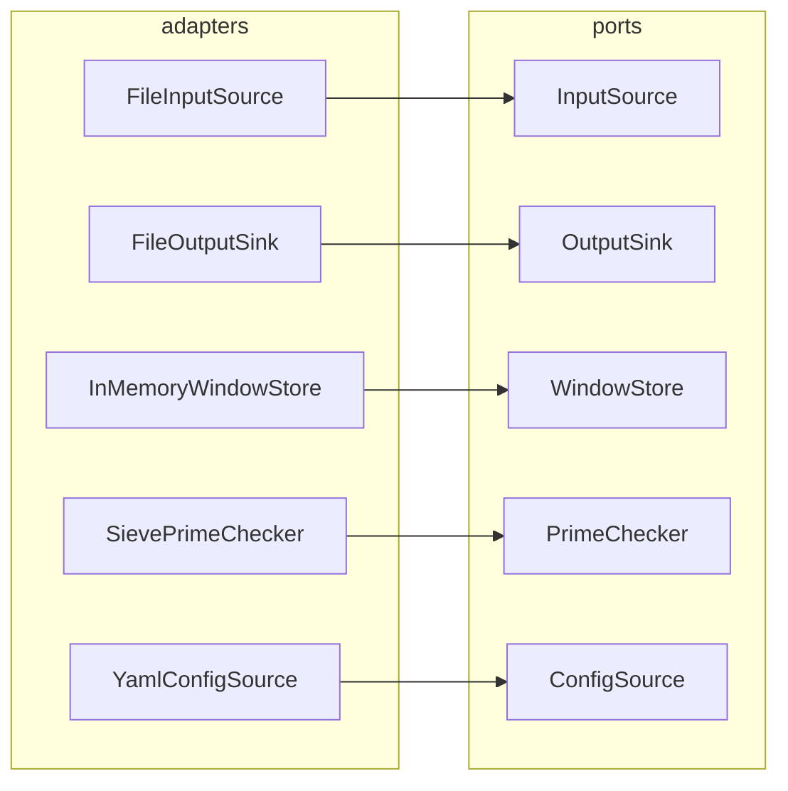
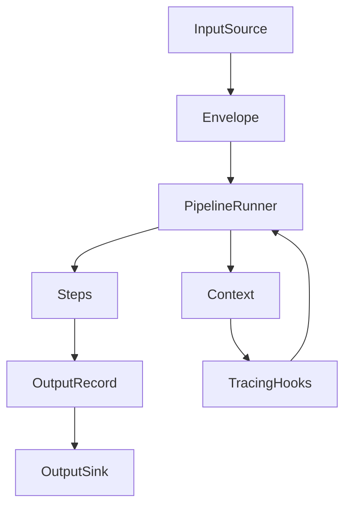

# Intro

This document explains the **project structure**, the **reasoning behind it**, and the **dependency boundaries** it enforces.

The structure is intentionally aligned with:
- **Hexagonal Architecture (Ports & Adapters)** — explicit boundaries, replaceable I/O
- **DDD-inspired layering** — domain is pure, use cases orchestrate domain logic
- **Ruby-friendly engineering practices** — explicit composition, minimal framework magic, pipelines as first-class objects
- **Messaging / integration patterns** — event flows, immutable messages, side-channel execution context

> The core design choice:  
> **Kernel is runtime, not business logic.**  
> Steps are *use-case behavior* and live outside the kernel.

---

## 1. Conceptual layers

### 1.1 Domain
Holds the language of the problem:
- money semantics
- time semantics and window keys
- decision semantics and reason codes
- policy vocabulary (daily limits, weekly limits, prime rule, Monday multiplier)
- invariants, value objects, and pure domain functions

**Domain must not depend on anything else.**

### 1.2 Kernel (Runtime)
Defines how the system executes a flow:
- message envelope model (message + metadata)
- execution context model (trace, metrics, errors)
- step contract and pipeline runner
- tracing / observability hooks
- port contracts (InputSource, OutputSink, WindowStore, ConfigSource)
- error model for pipeline execution

Kernel contains **no business decisions** and **no domain semantics**.
It is a reusable execution engine for a left-to-right flow.

More about [Kernel](../kernel/Kernel%20Overview.md)

### 1.3 Use Cases
Implements the business behavior of this specific challenge:
- the concrete steps (parse, compute keys, idempotency gate, compute features, evaluate policies, update windows, format output, write output)
- the wiring for assembling a pipeline from configuration
- use-case-level orchestration rules (what steps exist, what they expect, which ports they use)

Use cases depend on:
- `domain` (meaning)
- `kernel` (execution)

### 1.4 Adapters (Ports & Adapters)
Concrete integration implementations:
- reading NDJSON from a file
- writing NDJSON output to a file
- YAML config loader
- in-memory window store (reference implementation for the challenge)

Adapters depend on:
- `kernel/ports` (port protocols)
- sometimes `domain` (money/time parsing helpers, if explicitly allowed)

### 1.5 Service (Composition Root)
The executable entrypoint:
- loads configuration
- instantiates adapters
- assembles the use-case pipeline
- runs the flow

Service depends on everything, but everything else should not depend on service.

---

## 2. Dependency rules (must remain true)

The following dependency graph must be preserved:

- `domain` → depends on nothing in this project
- `kernel` → depends on nothing domain-specific (may depend on Python stdlib only)
- `usecases` → depends on (`domain`, `kernel`)
- `adapters` → depends on (`kernel`, optionally `domain`)
- `service` → depends on (`usecases`, `adapters`, `kernel`, `domain`)

**Forbidden:**
- `domain` importing `kernel`
- `domain` importing `adapters`
- steps importing `service`
- adapters importing `usecases`

This keeps the system testable and prevents “framework gravity” from polluting the domain.

---

## 3. Proposed repository layout

```graphql
src/
  domain/
    # Pure domain language and invariants  
    # (value objects, semantics, reasons, policies, windows)
  kernel/                     # runtime only
    context.py                # Ctx, Trace, Span
    message.py                # Envelope[T], metadata
    step.py                   # Step Protocol, combinators
    pipeline.py               # runner, composition primitives
    tracing.py                # hook interface + default logger
    errors.py                 # failure model for pipeline execution    
  ports/                    # port Protocols 
    #(InputSource/OutputSink/WindowStore/Config)
    input_source.py
    output_sink.py
    window_store.py
    config_source.py

  usecases/                   # steps live here
    load_adjudication/
      steps/
        parse_load_attempt.py
        compute_time_keys.py
        idempotency_gate.py
        compute_features.py
        evaluate_policies.py
        update_windows.py
        format_output.py
        write_output.py
      wiring.py               # builds pipeline for this use case

  adapters/
    ...
  service/
    main.py

```


> Note: exact file/module names may change, but the **layer intent** must not.

---

## 4. Why steps are not in the kernel

A common failure mode in pipeline architectures is turning the pipeline runtime into a
business framework where steps become “plugins” inside the core.

We avoid this by separating:

- **Kernel**: how to run any pipeline deterministically
- **Use Case steps**: what the pipeline does for this business scenario

This ensures:
- the kernel stays small and stable
- steps remain domain-aware and scenario-specific
- future use cases can reuse the kernel without inheriting business assumptions

---

## 5. Why Context and Envelope belong to the kernel

The system uses two channels:

- **Message** (domain object): immutable, meaningful, auditable
- **Context** (execution metadata): mutable, short-lived, operational

Context is not domain state. It is:
- tracing and correlation identifiers
- step-level metrics and tags
- error notes and debug breadcrumbs
- optional execution mode / config profile references

Because context is about execution semantics (not business semantics),
it belongs in the kernel.

The domain layer must remain runnable without context.

---

## 6. Ruby-friendly rationale

This structure mirrors practices common in Ruby teams that value explicitness:

- pipeline composition resembles `Enumerable`-style transformations
- service objects / operations map naturally to `usecases/*`
- magic is avoided by:
  - explicit wiring in a composition root
  - visible pipeline steps in a single use-case module
  - configuration choosing steps and parameters, not expressing logic

This is similar in spirit to:
- “service objects” and “interactors”
- operation pipelines (dry-transaction / trailblazer-like mental model)

But implemented with Python’s explicit protocols and dataclasses.

---

## 7. Ports and adapters: why we keep them even for a take-home task

Even though the challenge is file-based, the business story implies
real-world integration scenarios (funds, velocity limits, regulator logic).

Ports and adapters allow us to:
- isolate file I/O from adjudication logic
- keep steps testable without touching filesystem
- make the “engine” reusable (Kafka input / HTTP sink / DB windows later)

This is not overengineering: it is boundary hygiene.

---

## 8. Testing implications

This structure supports a clean test pyramid:

- **Domain unit tests**: pure functions and invariants
- **Kernel unit tests**: pipeline runner semantics, context propagation, tracing hooks
- **Step unit tests**: behavior of each step in isolation using fake ports
- **Scenario tests**: end-to-end pipeline with in-memory adapters

The dependency rules above prevent tests from becoming integration-only.

---

## 9. Documentation placement

Documentation mirrors the same conceptual structure:

- `docs/domain/` — semantics, invariants, reason codes
- `docs/architecture/` — project structure, execution model, boundaries
- `docs/usecases/load_adjudication/steps/` — step specs and contracts
- `docs/ports/` — InputSource, OutputSink, WindowStore, PrimeChecker, ConfigSource
- `docs/analysis/` — dataset analysis, reference output generation, experiments

---

## 10. Diagrams

The following diagrams illustrate the ideas and design:

- **Rings diagram**: domain / kernel / usecases / adapters / service
- **Pipeline flow diagram**: left-to-right step execution
- **Port map**: which steps depend on which ports
- **Runtime tracing diagram**: context propagation and step spans

> Architecture




> Load Adjudication Pipeline


> Ports and Adapters Map  


> Runtime execution model + Tracing/Observability Flow


---
