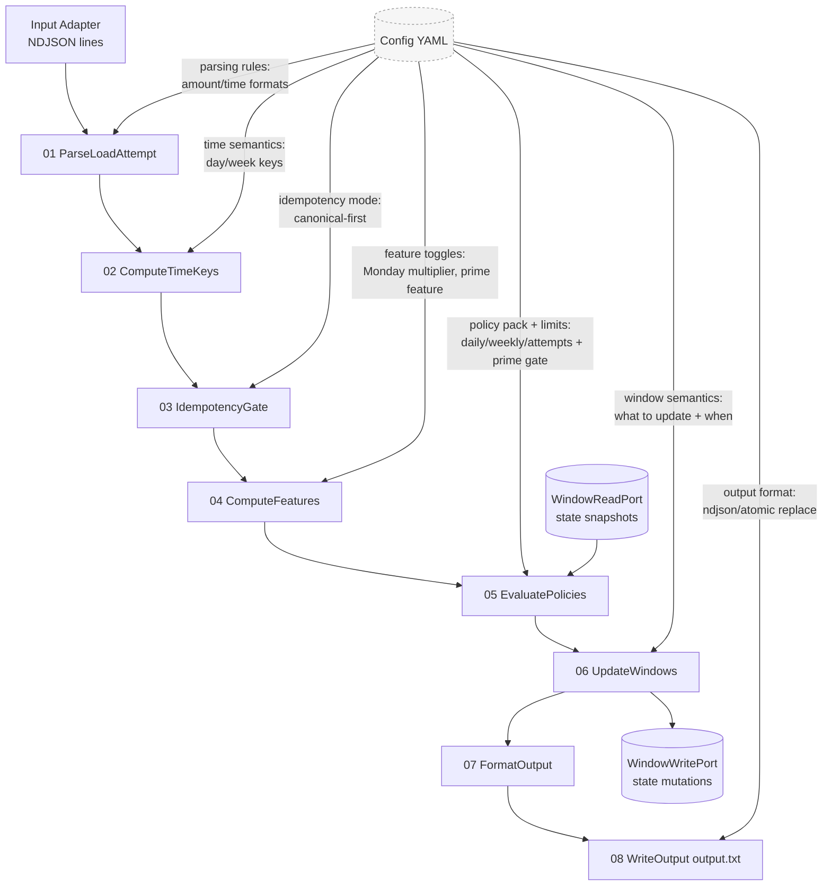

# Intro

This directory contains step-by-step specifications for the processing flow.  
The flow is designed to be **left-to-right**, deterministic, and configuration-driven (composition/parameters), while keeping business meaning in code.

## Step documents

1. [01 ParseLoadAttempt](./01%20ParseLoadAttempt.md)  
2. [02 ComputeTimeKeys](./02%20ComputeTimeKeys.md)  
3. [03 IdempotencyGate](./03%20IdempotencyGate.md)  
4. [04 ComputeFeatures](./04%20ComputeFeatures.md)  
5. [05 EvaluatePolicies](./05%20EvaluatePolicies.md)  
6. [06 UpdateWindows](./06%20UpdateWindows.md)  
7. [07 FormatOutput](./07%20FormatOutput.md)  
8. [08 WriteOutput](./08%20WriteOutput.md)  

---

## Flow overview (Mermaid)

## Where configuration matters

- **01 ParseLoadAttempt**: accepted input formats, normalization rules
- **02 ComputeTimeKeys**: UTC handling, day/week key semantics
- **03 IdempotencyGate**: canonical-first behavior, duplicate classification mode
- **04 ComputeFeatures**: feature toggles (Monday, Prime) + parameters
- **05 EvaluatePolicies**: policy pack selection, evaluation order, thresholds
- **06 UpdateWindows**: what windows exist and which decisions mutate them
- **08 WriteOutput**: output mode (NDJSON), file path, atomic replace/fsync
